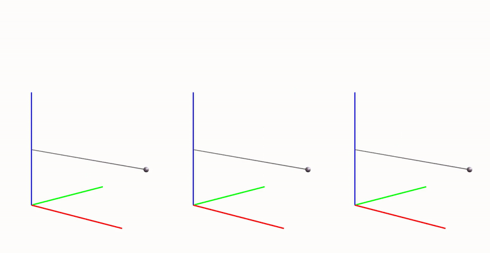

# Modeling defromable objects using the rigid finite element method

    
    <!-- 
Figure 4. Comparison between three different RFEM discretizations. From left to right: 3 segments, 5 segments and 10 segments
 -->

This repo shows a  way to implement the rigid finite element method (RFEM) for modeling deformable objects. To learn more about the RFEM read my tutorial [blogpost](https://shamilmamedov.com/blog/2023/rfem/).

## Getting started
Install all the packages from `requirements.txt` and run `main.py`. To change the elasticity parameters of the rod use `rod_params.py` file. To add new custom controllers use the base class from `controllers.py`. 